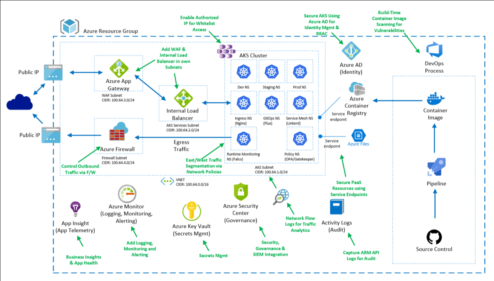

# Introduction
This is an example secure configuration that follows the AKS best practices. [https://aka.ms/aks/bestpractices](https://aka.ms/aks/bestpractices)
To demonstrate the security controls we are using, we will use a sample application comprised of a web FrontEnd and a BackEnd that is classifying fruit images that are stored in Azure Storage.

## **Disclaimer**

**The features described in this workshop might be not yet production-ready, we enable preview-features for the purpose of learning.**

## End Goal
The end goal is to take you from having a Kubernetes setup that is unsecure by default, to an Enterprise ready configuration that is secured by default.
 
See also :

- [Public and Private AKS Clusters Demystified](https://techcommunity.microsoft.com/t5/core-infrastructure-and-security/public-and-private-aks-clusters-demystified/ba-p/3716838)
- This [Attack matrix for Kubernetes from Azure Security Center](https://www.microsoft.com/security/blog/2020/04/02/attack-matrix-kubernetes/)

- AKS [videos](https://azure.microsoft.com/en-us/resources/videos/index/?services=kubernetes-service&sort=newest)

- [Azure Cloud Adoption Framework](https://docs.microsoft.com/en-us/azure/cloud-adoption-framework/innovate/kubernetes)

1. Setup [Tools](tools.md) ~30 minutes
1. Check [subscription](subscription.md) ~5 minutes
1. Setup [environment variables](set-var.md) ~5 minutes
1. Setup [pre-requisites](setup-prereq-rg-spn.md) ~10 minutes
   1. Create RG
   1. Create Storage
   1. Setup [Network](setup-network.md) ~ 2h
      1. Setup [Azure Firewall](setup-azure-firewall.md) ~30 minutes
      1. Setup [egress traffic lockdown](setup-egress-lockdown.md) ~30 minutes
   1. Create [SSH Keys](setup-prereq-rg-spn.md#Generates-your-ssh-keys)
1. Setup AKS
   1. Setup [AAD Integration](setup-AAD.md) ~30 minutes
   1. Setup [ACR with Private-Link](setup-acr.md) ~30 minutes
   1. Setup [KeyVault with Private-Link](setup-kv.md) ~30 minutes
   1. Setup [AKS cluster with Private-Link](setup-aks.md) ~30 minutes
1. Configure [Kubeconfig access](setup-kubeconfig-access.md)
1. Setup AKS [node pools](setup-nodepools.md)
1. Setup [HELM](setup-helm.md)
1. Setup [Application Gateway](setup-appgw-waf.md) ~30 minutes
1. Setup Azure Policy / [Open Policy Agent](setup-azure-policy-opa-gk.md)
1. Setup Application Gateway Ingress Controller - [AGIC](setup-agic.md)
1. Setup Service-Mesh / [Linkerd](setup-linkerd-service-mesh.md)
1. Setup [Kubernetes REboot Daemon](setup-kured.md)
1. setup [Azure Arc](setup-azure-arc.md)
1. SOC / [SIEM Integration](setup-soc-siem-integration.md)
